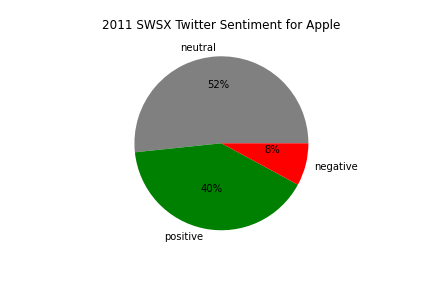
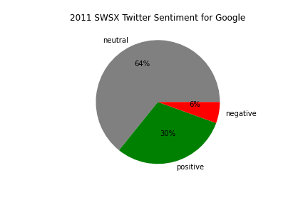

### Phase 4 Project
This project was a collaboration between 
* Benito Ywani
* Patrick Arnold
* Ahmad Samiee

# Technical Summary
Our best model for Twitter sentiment prediction was Support Vector Classification which gave an overal accuracy of about 67%. The model under-predicted for all three classifications relative to actual for both firms.  It missed predicting correctly negative sentiment the most followed by positive and then neutral.  This may be because the dataset contained the fewest negative sentiment tweets, followed moderate number of positive tweets and the most number of neutral tweets. However, our model was able to correctly predict the overall trend for classification ratios where tweets with neutral sentiment had the highest ratio followed by positive and then negative. In addition, our model was able to correctly predict which of the two firms had a higher positive sentiment (this was also the case for neutral and negative sentiments). 

# Business Problem
Our stakeholder an equity investment firm is considering to purchase equity in a technology compnay and they have narrowed down their selection between two compnaies.  As an additional analysis tool they like to take look at (potential customer) sentiment toward these two final selections. Therefore, they want a machine learning model that can predict sentiment in social media paltform like Twitter and also want to know how acurrately it can predict sentiment. 

## Master Dataset
The data comes from CrowdFlower via [data.world](https://data.world/crowdflower/brands-and-product-emotions) which are tweets from Twitter collected during 2011 at South by Southwest Conference. It consists of about 9000 tweets and each tweet labelled as negative, neutral or positive. 

## EDA and Feature Engineering
Created a column to identify whether the tweet was about Apple, Google or neither. Duplicated tweets, tweets for which there is no sentiment label and tweets that were neither about Apple or Google were dropped. Created another column to convert text sentiment into a numerical where 0 is for negative, 1 for neutral and 2 for positive sentiment. The cleaned data was then split into apple and google dataframes. These were then split into train (60% of data) and test (40%) dataframes where the three classification ratios for sentiment were split proportionally.  The trained datasets for apple and google were combined into a single dataframe to be used for model training. The tweet text was then processed for natural language processing(NLP) as described in nlp_doc_preparer function. 

## Model Training and Model Prediction
Used CountVectorizer (and to lesser extent TfidfVectorizer) to convert text tweet into matrix of tokens.  The models were trained and validated with the combined train dataframe from apple and google tweets. Used pipes to minimize redundant code an gridsearchcv for model tuning and validation. Model predictions were made with apple and google test dataframes. 

Confusion Matrix with Base Model 
 | 

## Conclusion
The base model, DummyClassifier, had a validation accuracy of about 56% on the combined apple and google tweet dataframe (train dataframe). Predictions for apple and google tweet test samples were performed separately to be able to compare the two between one another for sentiment.  The base model gave a prediction of 52% accuracy for apple and 64% for google with an overal average accuracy of 58%.  Five additioanl models (Multinomial NB, KNeighbor, Random Forest, Logistic Regression and SupportVectorClassifier(SVC))were then evaluated for their prediction performance and they all gave similar accuracy within 5% of each other.  SVC model was selected as our best model as it gave overall better performance relative to the other four. Validation accuracy for SVC model was about 65%. For test samples, accuracy for apple was about 63% and for google 71% with an overall accuracy of 67% for our best model. Utilized gridsearchcv to adjust hyperparamters(tunning) for these models. Following NLP processing the tweet text was converted into matrix of tokens using mostly CountVectorizer for TfidfVectorizer diminished model performance a little bit. To correct for data classification imbalance (7% negative, 56% neutral and 37% positive sentiment) the combined trained data was synthetically balanced using SMOTE.  However, this did not improve model performance. We also tried neural network Sequential model but were unable to increase accuracy.

Our best model for Twitter sentiment prediction was therefore SVC which gave an overal accuracy of about 67%. The model under-predicted for all three classifications relative to actual for both firms. Also, it missed predicting correctly negative sentiment the most followed by positive and then neutral.  This may be because the dataset contained the fewest mumber of negative sentiment tweets.However, our model was able to correctly predict the overall trend for classification ratios where tweets with neutral sentiment had the highest ratio followed by positive and then negative. In addition, our model was able to correctly predict which of the two firms had a higher positive sentiment. 

## Next Steps:
To potentially improve models performance
* Take a closer look at tweets that had negative sentiment.  Our best model missed these more than positive and neutral sentiments
* Setup a model based on scoring words or phrases for negative, neutral or positive sentiment
* Consider data from other social media platforms like review sites for products and services
